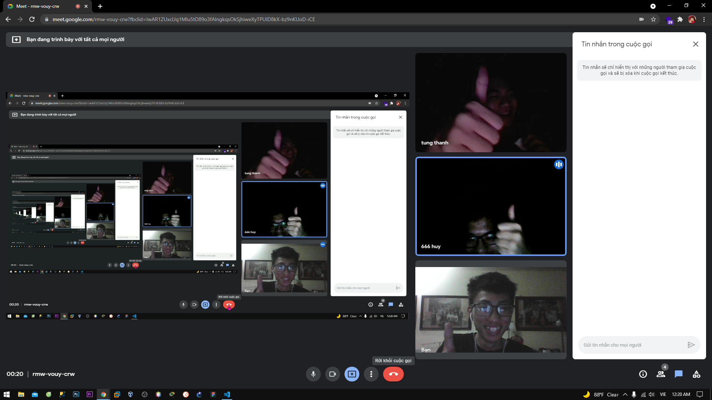
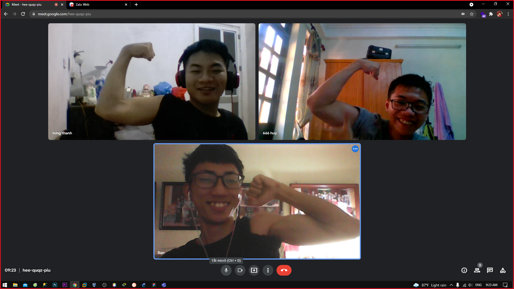

<h1 align='center'>Welcome To DATV</h1>


Run web: npm run dev

# Website sàn thương mại điện tử - VShop (DATV)
| SINH VIÊN THỰC HIỆN | VŨ MẠNH ĐẠT
| :------------: |:---------------|
| -LEADER- | VŨ MẠNH ĐẠT|
| -STAFF- | ĐOÀN THANH TÙNG|
| -STAFF- | BÙI MẠNH HUY|

```diff
    \\ LEADER :==> VUMANHDAT - 
    -   PHÂN CÔNG CHO STAFF LÀM VIỆC ĐỒNG THỜI TRONG QUÁ TRÌNH LÀM VIỆC SẼ HỖ TRỢ CÁC BẠN KHI CÓ VẤN ĐỀ XẢY RA.
```
```js
    \\ SUPPORT / STAFF : ==> BUIMANHHUY -
    -   ĐƯỢC PHÂN CÔNG LÀM WORD 
    +   TRONG QUÁ TRÌNH LÀM CÓ SỰ GIÚP ĐỠ CỦA TEAM (LEADER and TÙNG)
```
```html
    \\ SUPPORT / STAFF : ==> DOANTHANHTUNG -
    -   ĐƯỢC PHÂN CÔNG LÀM GIAO DIỆN WEB - FRONTEND
    +   TRONG QUÁ TRÌNH LÀM CÓ SỰ GIÚP ĐỠ CỦA TEAM (LEADER and TÙNG)
```

### ==> [File FPD](https://github.com/CompanyDATV/DuAnVShopee/blob/today-dat/VSHOP.pdf) || scripted by [@V](https://www.facebook.com/VuManhDat412/) || last edited :07/05/2021

<h1 align='center'> Word Docx 2021 </h1>


# ae chúng tôi đã làm việc như thế nào 




<center>Resolve ==> </center>

* LEADER:   đưa ra use case Tổng quát, sau đó phân công cho các bạn cùng làm 
    - lấy từ tổng quát chia ra thành các 

<h1>Vì một số lý do cho nên đội ngũ chúng tôi không thể hoàn thành xong dự án, mong các bạn đọc thông cảm cho nha</h1>
<h1>Có thời gian tôi sẽ update chúng :3</h1>

##Ngoài ra bạn có thể ghé thăm Kênh của tôi xem nhưng video tôi làm các dự án trong tương lai <h1> [Link ne`](https://www.youtube.com/channel/UCYBs7r2XzwiEfvuZ33g7ymg)</h1>
